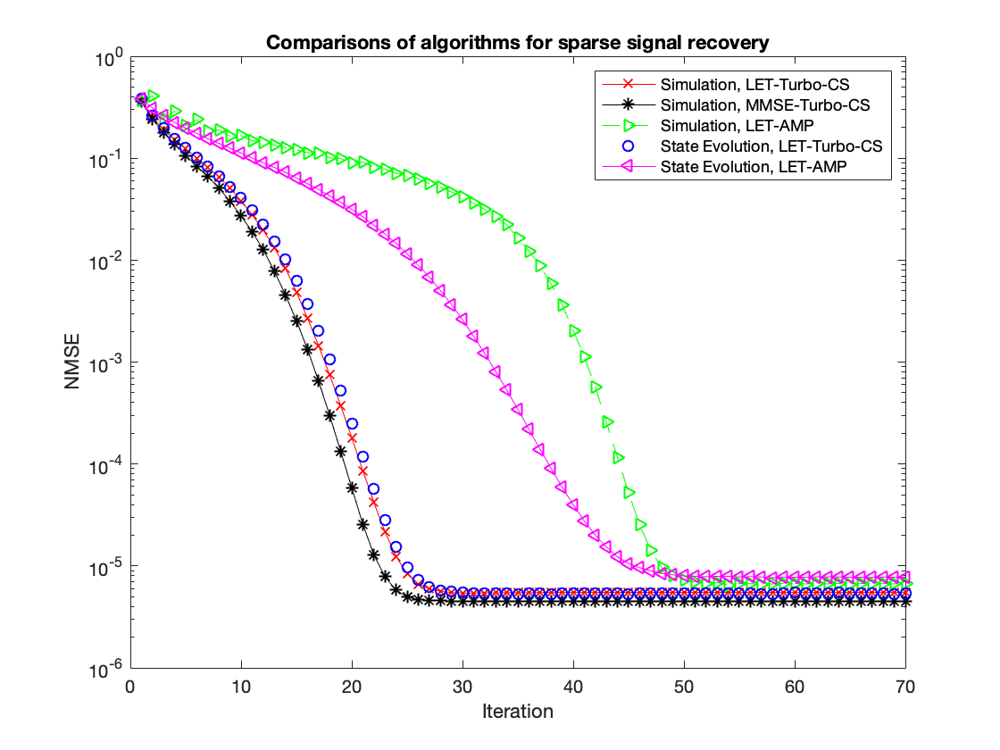

# Denoising-Based Turbo Compressed Sensing

This repository contains the implementation of the **Denoising-based turbo compressed sensing (D-Turbo-CS)** algorithm proposed in the paper:

> Z. Xue, J. Ma, and X. Yuan, "Denoising-Based Turbo Compressed Sensing," IEEE ACCESS, vol. 5, pp. 7193-7204, April, 2017. doi: [10.1109/ACCESS.2017.2697978](https://doi.org/10.1109/ACCESS.2017.2697978)

## Introduction

D-Turbo-CS is a denoising based message passing algorithm for compressed sensing recovery and compressive image sensing recovery.

## Code Structure

`DTurboCS.m`: Denosing based Turbo compressed sensing algorithm.

- Input parameters
  - `y`: measurement vector
  - `A`: sensing matrix, here we implement it as a linear opeartor
  - `At`: transpose of sensing matrix `A`
  - `params`: parameters used in recovery
  - `errx`: evaluation function

`BM3D_denoiser.m`: BM3D denoiser, users should install BM3D matlab package first

`kernel_lin_1.m`: SURE-LET denoiser used in this paper

`LinerOperator.m`: generate linear operator `A` and its transpose operator `At` of sensing matrix with different size and type

`demo_image.m`: demo of compressive image sensing recovery using the D-Turbo-CS algorithm

`demo_sparse_signal.m`: demo of sparse signal recovery using the D-Turbo-CS algorithm

`SE_DTurboCS.m`: state evolution function of D-Turbo-CS

## Citation

```
@ARTICLE{7912330,
  author={Z. {Xue} and J. {Ma} and X. {Yuan}},
  journal={IEEE Access}, 
  title={Denoising-Based Turbo Compressed Sensing}, 
  year={2017},
  volume={5},
  number={},
  pages={7193-7204},
  doi={10.1109/ACCESS.2017.2697978}}
```


## Test Result

Run `demo_sparse_signal.m`, you will get the simulation result of Figure 3 of the paper:



